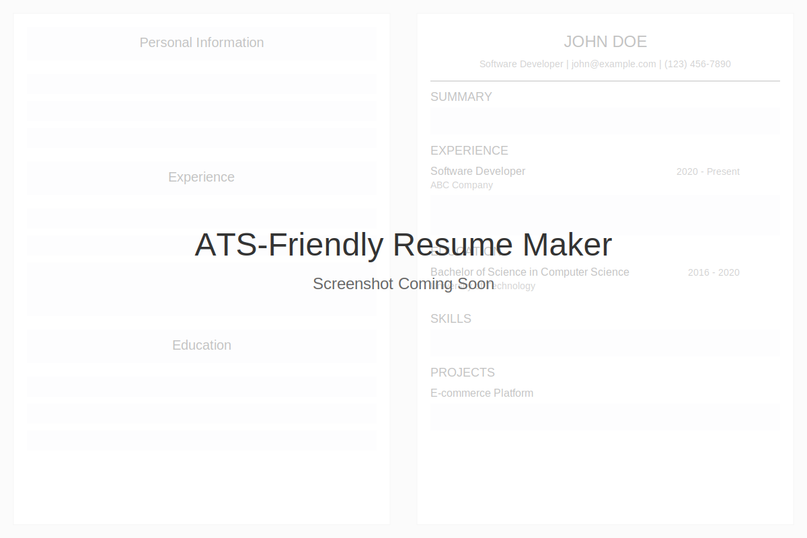

# ATS-Friendly Resume Maker

A powerful, browser-based tool for creating professional, ATS-optimized resumes that stand out to both automated systems and human recruiters.



## Features

- **ATS Optimization**: Designed specifically to pass Applicant Tracking Systems
- **Multiple Templates**: Choose from Classic, Modern, Minimalist, and Professional designs
- **Single-Page Focus**: Automatic compact mode to fit content on one page
- **Job Description Analysis**: Analyze job descriptions to highlight matching keywords
- **Plain Text Export**: Generate plain text versions for online applications
- **PDF Download**: Create professional PDF resumes with one click
- **Local Storage**: Auto-saves your work as you type
- **Version Management**: Save and manage multiple resume versions
- **Data Import/Export**: Backup and transfer your resume data
- **Mobile Responsive**: Create resumes on any device
- **Section Reordering**: Drag and drop sections to customize layout
- **Skill Ratings**: Add visual skill ratings with star indicators
- **Customizable Sections**:
  - Personal Information (with optional DOB)
  - Summary
  - Skills (with ratings)
  - Experience
  - Education (with GPA/percentage options)
  - Projects
  - Certifications
  - Languages (with proficiency levels)
  - Achievements & Honors

## Resume Sections

### Personal Information
- Name, job title, contact details, location, and optional date of birth
- Professional links (GitHub, personal website)

### Summary
- Concise professional summary highlighting your key qualifications and career objectives

### Skills
- Regular skills section with formatting options
- Rated skills with visual star indicators

### Experience
- Company name, job title, dates, location
- Detailed description with bullet points

### Education
- School/university, degree, dates, location
- GPA or percentage score options

### Projects
- Project name, technologies used
- Description, links to live demo and GitHub

### Certifications
- Certification name, issuing organization
- Issue date, expiration date, credential ID

### Languages
- Language name and proficiency level

### Achievements & Honors
- Achievement title, date, and description

## How to Use

1. **Getting Started**:
   - Visit the application at [https://emaniaditya.github.io/ATS_Friendly_Resume_Maker/](https://emaniaditya.github.io/ATS_Friendly_Resume_Maker/)
   - A sample resume will be loaded automatically to help you get started

2. **Fill in Your Information**:
   - Navigate through each section and enter your details
   - Use the "Add" buttons to create additional entries for experience, education, etc.

3. **Customize Your Resume**:
   - Select a template from the dropdown menu
   - Reorder sections by dragging and dropping in the "Section Order" panel
   - Enable compact mode to fit more content on one page

4. **Preview and Adjust**:
   - Click "Preview Resume" to see how your resume looks
   - Use the density controls (Low/Normal/High) to adjust content density

5. **Save Your Work**:
   - Your work is automatically saved in your browser's local storage
   - Use "Manage Saved Versions" to save named versions of your resume
   - Export your data for backup or transfer to another device

6. **Download and Share**:
   - Click "Download PDF" to generate a professional PDF
   - Use "View Plain Text" or "Download Plain Text" for online applications

7. **ATS Optimization**:
   - Paste a job description in the "Job Description Analysis" section
   - Click "Analyze Keywords" to identify important keywords to include

## ATS Optimization Tips

1. **Use Standard Section Headings**:
   - The application uses ATS-friendly section titles

2. **Include Keywords from Job Descriptions**:
   - Use the keyword analysis tool to identify important terms
   - Naturally incorporate these keywords in your resume

3. **Keep Formatting Simple**:
   - The templates are designed to be ATS-friendly
   - The Classic template has the highest ATS compatibility

4. **Use Plain Text for Online Applications**:
   - Generate a plain text version for pasting into online forms

5. **Quantify Achievements**:
   - Include numbers and metrics in your experience and achievements

6. **Be Consistent**:
   - Use consistent formatting for dates and locations

7. **Include Contact Information**:
   - Ensure your name and contact details are clearly visible

8. **Date of Birth Considerations**:
   - Only include DOB if required for specific regions/applications
   - Many countries have anti-discrimination laws regarding age

9. **Education Scores**:
   - Include GPA if it's 3.0+ (US) or equivalent
   - For percentage scores, include if they're above average for your program

## Deployment

The application is automatically deployed to GitHub Pages when changes are pushed to the `main` branch. The deployment workflow is configured in `.github/workflows/deploy.yml`.

### Manual Deployment

If you want to deploy the application manually:

1. Clone the repository:
   ```
   git clone https://github.com/EmaniAditya/ATS_Friendly_Resume_Maker.git
   ```

2. Navigate to the project directory:
   ```
   cd ATS_Friendly_Resume_Maker
   ```

3. Open `index.html` in your browser or use a local server:
   ```
   # Using Python's built-in server
   python -m http.server
   ```

4. Visit `http://localhost:8000` in your browser

## Browser Compatibility

The application works best in modern browsers:
- Chrome (recommended)
- Firefox
- Edge
- Safari

## Privacy

All data is stored locally in your browser using localStorage. No data is sent to any server.

## Contributing

Contributions are welcome! Please feel free to submit a Pull Request.

## Credits

- Designed by [@anjalisahu4644](https://github.com/anjalisahu4644)
- Developed by [@EmaniAditya](https://github.com/EmaniAditya)

## License

This project is licensed under the MIT License - see the LICENSE file for details.